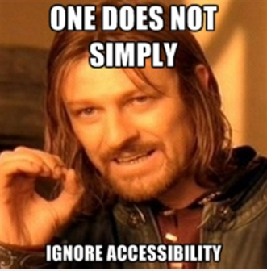

## ACCESSIBILITY

**Objectives of the project**
- ARIA’s main purpose
- WCAG conformance levels (A, AA and AAA)
- The importance of Web Accessibility
- Tools to use for Web Accessibility

**Project Requirements**
- Allowed editors: vi, vim, emacs
- A README.md at the root of the project directory is mandatory
- HTML and CSS have been rendered on Chrome 78 or more.